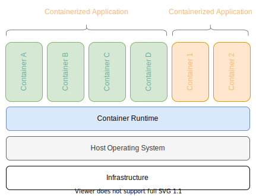
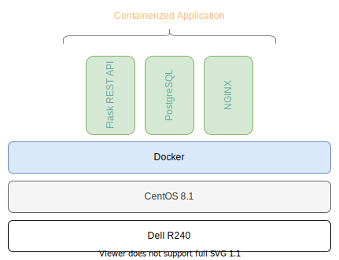

## Introduction to
# Kubernetes

---

## A few words about
# this training

Notes:
* I started working with Kubernetes a few months ago, when we wanted to improve delivery time of your applications 
* I am not the most experienced Kubernetes user, but can help you out with the first steps and giving you an overview
* This training is not only for you, it is also for me, to expand my knowledge by forcing myself to learn more about K8s

---

## Schedule

* What is a container?
* Creating a container
* Running a container

* What is Kubernetes?
* Set up a local Kubernetes cluster
* Deploy the previously created container

---

## Slides

[https://escodebar.github.io/trainings/k8s/introduction/](https://escodebar.github.io/trainings/k8s/)

Notes:
* You can find the speaker notes in the slides, which allows you to go through the training at home
* If a slide needs clarification, please let me know!

---

# Are you ready?

---

## What is a
# Container?

---

## Standard unit of software

...containing:
* Code
* Runtime
* System tools
* System libraries
* Settings

Notes:
* Packages up code and all its dependencies, so the application runs quickly and reliably from one environment to another

---



---

## Example



---

## Creating a
# container

---

## Container files

...allow us to create container images!

Let's create a very simple one!
```shell
$ cat << EOCF > Containerfile
FROM debian:buster-slim
CMD ["echo", "hello world"]
EOCF
```

Notes:
* Containers are based on other container image files
* The statement `FROM` indicates the image it is based on
* The statement `CMD` tells what command to run

---

## Building the container image

```shell
$ docker build --tag hello-world -f Containerfile
STEP 1: FROM debian:buster-slim
Getting image source signatures
Copying blob c499e6d256d6 done  
Copying config 8e022c70c2 done  
Writing manifest to image destination
Storing signatures
STEP 2: CMD ["echo", "hello world"]
STEP 3: COMMIT hello-world
--> 25af7457b1e
25af7457b1ee32a2abe569c4ab961f7ece25f8a122386604cf1774611c5f98d0
```

Notes:
* You can provide tags

---

## Running the container

```shell
$ docker run hello-world
hello world
```

---

## Take a look at the running containers

```shell
$ docker ps -a
CONTAINER ID  IMAGE                         COMMAND           CREATED         STATUS                     PORTS  NAMES
8839ef72e5a9  localhost/hello-world:latest  echo hello world  16 seconds ago  Exited (0) 16 seconds ago         practical_dubinsky
```

---

## Exercices

----

Take a look at:
* the [Dockerfile reference](https://docs.docker.com/engine/reference/builder/#dockerfile-reference)
* the [`docker build` reference](https://docs.docker.com/engine/reference/commandline/build/)
* the [`docker run` reference](https://docs.docker.com/engine/reference/run/)

----

* some of the container images in [dockerhub](https://hub.docker.com/)

----

What happens if the image is rebuilt
* without further changes?
* changing `world` to `people`?

---

## Discussion

* Whas is the difference between:
  - the container file
  - the container image
  - the container
* What are benefits of containerization?
* What alternatives to containers exist?

---

## What is
# Kubernetes?

---


---

## Exercises


---


---

## Resources

* [What is a container?](https://www.docker.com/resources/what-container)
* [What is Kubernetes](https://kubernetes.io/docs/concepts/overview/what-is-kubernetes/)

---

## Questions & Feedback

---

## Thank you!

🍺🍻🍺
