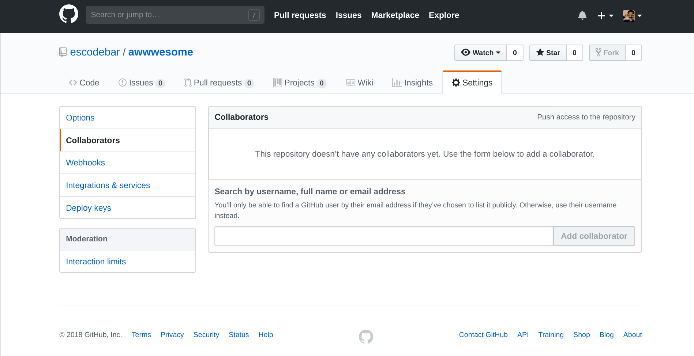

# Learning Git
# the hard way

---

<!-- .element: height="500px" -->

Notes:
* The goal is to show what Git does when it is used, to allow you to choose when and how to use it
* The training covers theory for using Git, however brain muscle is needed
* Use *all* the commands and ask yourself how you can improve your workflows
* This training is made for people who barely used Git before, but includes information for more experienced users
* This training covers using Git when there is no "happy path"
* A short introduction to GitHub and the pull-request workflow is also made
* Some parts of this training are rather technical and go deep into Git's internals
* It's going to be tough, but hopefully fun as well!

---

## Schedule

* Version control systems
* Understanding and using Git
* Understanding and using GitHub
* Collaborating with Git / GitHub

Notes:
* For starters the concept of version control systems is introduced
* I will try to give you a motivation to use version control systems even when you work on your own
* The main course will be about Git, its usage and its internals
* During this part I will give you guidelines I found very useful
* As soon as we're ready to take a look at remote repositories, GitHub will be introduced
* A whole course could be dedicated to GitHbu, therefore we won't be covering all of its features
* Once we feel comfortable with most of GitHub's UI, we will see how it can be used for collaboration
* Only a simple collaboration workflow will be covered

---

Pablo Vergés
([GitHub](https://github.com/escodebar),
[Bitbucket](https://bitbucket.org/escodebar))

Notes:
* I don't want to go into much details about myself
* Come towards me during the breaks or after the lecture
* You may also send me an email

---

## Requirements

If you know how to type commands in a terminal and parse its output,
this training is made for you!

Notes:
* Reading is crucial here, you'll be using the "man"-pages a lot!
* No specific Git editor integration is discussed
* Also no Git GUI is discussed
* Many intergrations and GUIs do not cover all of Git's features, so I recommend you to get used to the terminal
* In many occasions you'll find yourself connected to a server with a Git repository, knowing the commands in that situation is crucial
* For some features, an integration for your favorite editor might be useful, yet start using the terminal

---

## Version control systems

What is a VCS and why do I need it?

* Collaboration
* Version control
* The tangled working copy problem

Notes:
* Collaboration: Ever tried to collaborate using a shared folder?
* Version control: How are new features added to stable versions?
* "The tangled working copy problem" is discussed later
* Never lose a line of code again and forget about rewriting work already done!

Statistics:
* Who worked already in a collaboration?
* How many people where part of the collaboration? (2, 5, 10, bigger groups)
* Who collaborated using Dropbox?
* How did you exchange code / text files?
* Who had to maintain several versions of the same software already?
* How did you handle that situation?

---

## Other motivations

A VCS may also be helpful for:
* Continuous Integration
* Continuous Deployment
* Error analysis
* System analysis

Notes:

Integration:
* Tests may be run against code changes automatically to detect possible functionality breaks or bugs
* You may also compile the code automatically after a significant change
* Automate systematic work

Deploying:
* Install a specific version of an application without breaking a sweat
* Automate systematic work

Error analysis:
* Find out which is the breaking change
* Find out who broke the software

System analysis:
* See what happens within your system when you use it
* Find out what the difference is between system configurations

---

## The
## tangled working copy
## problem

Notes:

Situation:
* You have a working software version
* You introduce experimental changes
* You notice a bug (not introduced by the experimental changes)
* You want to fix the bug and keep the experimental changes

With enough Git routine, this won't be a problem again.
Not all version control systems help you solving this situation

---

## Some VCS

ArX,
Bazaar,
BitKeeper,
Codeville,
CVS,
Darcs,
DCVS,
Fossil,
Git,
GNU arch,
Mercurial,
Monotone,
Perforce,
Subversion,
TFVCS,
Veracity, ...

Notes:

Statistics:
* Who worked with a version control system already?
* Which of the VCS listed here did you use?
* How was your experience with the VCS?
* Do you know a VCS which is not listed in here?

---

# Git

Notes:
* I have little experience with subversion and no experience with all the other VCS (besides Git)
* I started using Git, because the company I worked for used Git
* I kept using Git because I found enough "Why is Git better than X"-blog entries
* I keep using Git because Git is all I need (so far)
* Try to find out what your needs are and find the VCS which suits your use case (which will be probably be Git)

---

## Git

"*... is oddly liberal with how and when you use it.*"

* is a powerful analysis tool
* allows running automated tasks
* simplifies collaboration
* simplifies code organization
* makes working in parallel trivial
* solves the tangled working copy problem

Notes:
* Git does not force you to suit certain workflows, it doesn't get in your way
* Depending on your workflow, the development might be
  - chaotic (which is totally fine, think of eating)
  - organized
* This liberty requires understanding Git tough
* This liberty also allows to evolve your development workflow

---

# Git
## will make you
# a better programmer!

Notes:
* But only if you're willing to change! (Improvement always comes with change)

---

## Boot your notebooks

Notes:
If you feel that this training is not made for you, this is the right moment to leave the room

---

## Slides

https://escodebar.github.io/trainings/git/

Notes:
* The sildes are handy for clicking on links or copy-paste code
* You might press "s" to get the speaker notes, but don't do that during the training, as it will spoil a few jokes
* With "o" you get an overview of the slides for faster navigation
* The URL indicates the slide number (handy for asking questions)

---

## Setup

[Install Git](https://git-scm.com/book/en/v2/Getting-Started-Installing-Git)
and tell it who you are

```shell
$ git config --global user.name 'Pablo Escodebar'
$ git config --global user.email 'escodebar@gmail.com'
```

Then configure the editor you want to use
```shell
$ git config --global core.editor 'vim'
$ git config --global core.editor 'emacs'
$ git config --global core.editor 'subl -n -w'
$ git config --global core.editor 'atom --wait'
```

Notes:

Setup:
* Most of you probably have Git installed already, if not, please install Git using your package manager
* If you are using a Mac, follow the instructions of the link provided by the slides

Configuration:
* The configuration may be made per repository or per user
* You may want to configure a project with another author or email depending on the customer of the project (work, university, private...)

Editor configuration:
* Choose an editor you feel comfortable with (or get comfortable with the editor you choose)
* More settings can be configured, this is just a minimal setup, so please read the documentation about Git configuration

---

## First steps

Create a repository:

```shell
$ mkdir -p ~/working/directory/ && cd $_ && git init .
Initialized empty Git repository in ~/working/directory/.git/
```

```shell
$ ls -blah
total 0
drwxr-xr-x 3 escodebar escodebar  60 Aug  2 10:39 .
drwxr-xr-x 3 escodebar escodebar  60 Aug  2 10:38 ..
drwxr-xr-x 7 escodebar escodebar 200 Aug  2 10:39 .git
```

See that `.git` folder there? That's the repository.

Notes:
* During this training a repository is used
* We will be adding changes to the repository during the training to confront you with typical Git situations
* Please do not use an existing repository as it might change the output
* Everything tracked by Git is inside the repository
* If there is something you want to backup, then it's the ``.git`` folder

---

## Digging deeper

Don't panic!

```shell
$ ls -blah .git
total 12K
drwxr-xr-x 7 escodebar escodebar 200 Aug  2 10:39 .
drwxr-xr-x 3 escodebar escodebar  60 Aug  2 10:39 ..
drwxr-xr-x 2 escodebar escodebar  40 Aug  2 10:39 branches
-rw-r--r-- 1 escodebar escodebar  92 Aug  2 10:39 config
-rw-r--r-- 1 escodebar escodebar  73 Aug  2 10:39 description
-rw-r--r-- 1 escodebar escodebar  23 Aug  2 10:39 HEAD
drwxr-xr-x 2 escodebar escodebar 260 Aug  2 10:39 hooks
drwxr-xr-x 2 escodebar escodebar  60 Aug  2 10:39 info
drwxr-xr-x 4 escodebar escodebar  80 Aug  2 10:39 objects
drwxr-xr-x 4 escodebar escodebar  80 Aug  2 10:39 refs
```

This is deep enough for now!

Notes:
* Be aware of the listed objects
* HEAD, config, description are files
* The rest is folders
* To study the behavior of the repository, a repository is made inside the repository.

---

## Gitception

Behold
```shell
$ cd ~/working/directory/.git
```

We are creating a repository inside the repository
```shell
$ git init . && git add . && git commit -m 'Add the repository'
Initialized empty Git repository in ~/working/directory/.git/.git/
[master (root-commit) 1c2f932] Add the repository
 15 files changed, 653 insertions(+)
 create mode 100644 HEAD
 create mode 100644 config
 create mode 100644 description
 create mode 100755 hooks/applypatch-msg.sample
 [...]
 create mode 100755 hooks/update.sample
 create mode 100644 info/exclude
```
<!-- .element: style="font-size: 0.535em" -->

Don't do this at home!

Notes:
* Git keeps track of all the changes in the repository, it is therefore a perfect analysis tool
* Git goes up the directory path to the point where it finds a ``.git`` folder, but ignores its contents
* Therefore we can create a repository in the repository to track the changes and understand Git's behaviour
* Ignore the added files for now, most of them are discussed later during the training
* I haven't seen an other Git training doing this!

---


Notes:
* Xzibit shows up on every slide which uses the repository in the repository to set you in the right context
* You do not need to run the commands of these slides, since they're only for comprehension
* Open a second terminal window and navigate to the repository's repository to switch context easier

---

# Break

Notes:
* Go digest the Gitception

---

## What's the status?

To get an overview of the repository run:
```shell
$ git status
On branch master

No commits yet

nothing to commit (create/copy files and use "git add" to track)
```

Notes:
* The repository is on the master branch
* Branches are discussed later, for now, just remember that the master branch is the default branch
* There are no commits
* Commits are discussed in detail in a few slides
* Use ``git help`` to display the documentation of any command
* In many cases Git tells you what to do

---

## Let's do something!

Documentation first!
```shell
$ echo '# My awwwesome training' > README.md
```

What's the status now?
```shell
$ git status
On branch master

No commits yet

Untracked files:
  (use "git add <file>..." to include in what will be committed)

        README.md

nothing added to commit but untracked files present (use "git add" to track)
```
<!-- .element: style="font-size: 0.465em;" -->

Notes:
* You can tell Git to ignore files using ``.gitignore``
* Ignore large files and non-project specific files:
  - backup files
  - binary files
  - data files
  - system specific files (like .DS_Store, or local configurations)
  - files containing (personal) passwords

---

## The index

aka. *the staging area*

 <!-- .element: height="250px" style="background: white" -->

"*...is an intermediate area which allows to setup the change before making the commit.*"

Notes:
* Not all VCS have this feature!
* This solves the tangled working copy problem (but there are more ways!)

---

## Let's stage!

Put files in the staging area:
```shell
$ git add README.md && git status
On branch master

No commits yet

Changes to be committed:
  (use "git rm --cached <file>..." to unstage)

        new file:   README.md
```

Notes:
* The file is now in the ``changes to be committed``
* You can add whole directories (double check that there are no files which should not be included)
* You can also add parts of files (we will see the patch mode later), unless they're not tracked yet
* The Git integration of your editor may allow to stage a selection of lines (similar to the patch mode)

---


## What happened in the repository?

```shell
$ git add . && git commit -m 'Add files to index'
[master 6147d79] Add files to index
 2 files changed, 0 insertions(+), 0 deletions(-)
 create mode 100644 index
 create mode 100644 objects/b2/7501ade65f39bc91a5e6eb0d707903ba225a00
```
<!-- .element: style="font-size: 0.51em;" -->

<!-- .element: style="width: 150px;" -->

Notes:
* The index file is a binary file and it is not discussed in this training
* The name of the objects is given by their (SHA1) hash
* To improve file-system usage, the objects are stored in folders

Questions:
* How many folders will be created at max?
* How many files can be created?
* What's the probability to have two files with the same hash?

---

## Git objects

You can add any kind of content into a Git repository.
Git will store this content in an object.

Notes:
* Git objects are seen as part of the Git internals!
* Understanding objects is relevant for using Git well

---

## Inspect objects

Objects can be inspected using:
```shell
$ git cat-file -t b27501a
blob
```
```shell
$ git cat-file -p b27501a
# My awwwesome training
```

Notes:
* Files are stored as objects of type "blob" (Binary Large OBject)
* Not only files are stored in objects
* You can find the size of an object by using the ``-s`` flag
* Only the first few (min. 7) hexadecimal digits of a hash are required to determine the file
* More objects are discussed later

---

## Ready to commit?

See staged changes to check if they are ready to be committed:
```shell
$ git diff --cached
diff --git a/README.md b/README.md
new file mode 100644
index 0000000..b27501a
--- /dev/null
+++ b/README.md
@@ -0,0 +1 @@
+# My awwwesome training
```

Notes:
* Take a look at the changes to be committed before doing so
* Make sure you know, what you commit
* Make commits as small as possible for easier reviewing
* If keeping track of what it's being committed is hard, then you might need to rethink your workflow

---

## A commit

aka. *a change*

"*...represents a complete version of your code.*"

Notes:
* Complete means: Tested, documented and ready to ship
* A commit comes with a commit message
* Guidelines for commit messages exist
* Title as short as possible and in imperative mode
* One empty line after the commit title
* Describe WHY you are doing the change (WHAT is described in the code)
* If you need to describe the what, you should probably rethink your code
* If a commit is not complete, you might want to stash the changes instead or the title can be provided with a [WIP]
* If you have a test driven workflow, you may commit the test first and then the rest

---

## Git commit

You can commit the changes to the repository running:
```shell
$ git commit -m 'Describe the training'
[master (root-commit) 78d7aa6] Describe the training
 1 file changed, 1 insertion(+)
 create mode 100644 README.md
```
This commit is now (pretty) save

Notes:
* See ``master``?
* ``root-commit``: This is a special one, it has no parent
* Create mode with permissions
* You can also run just ``git commit``, then your editor will pop-up
* I did not describe the "why" here, do as I tell you, not as I do (here)

---

## Git show

Take a look at a change using:
```shell
$ git show
commit 78d7aa680e7ac5f3e851727ac29dd34afeb766f6 (HEAD -> master)
Author: Pablo Escodebar <escodebar@gmail.com>
Date:   Thu Aug 2 10:43:22 2018 +0200

    Describe the training

diff --git a/README.md b/README.md
new file mode 100644
index 0000000..b27501a
--- /dev/null
+++ b/README.md
@@ -0,0 +1 @@
+# My awwwesome training
```
<!-- .element: style="font-size:0.5em;" -->

Notes:
* See ``HEAD``, ``master``, etc.? We met these already
* ``HEAD`` is not discussed during this training
* ``master`` is a branch, branches are discussed later
* More details about commits are discussed in a few slides
* A commit hash can be passed to the show command to show a specific commit
* If no argument is passed, the currently checked out commit will be shown

---

## Time to dig deeper

The repository's content must have changed,
commit the changes and go back to the main repository

```shell
$ git add . && git commit -m 'Commit file'
[master 85240e8] Commit file
 7 files changed, 4 insertions(+)
 create mode 100644 COMMIT_EDITMSG
 create mode 100644 logs/HEAD
 create mode 100644 logs/refs/heads/master
 create mode 100644 objects/78/d7aa680e7ac5f3e851727ac29dd34afeb766f6
 create mode 100644 objects/a4/4f211c376b94d122c6429ef8e87ffa7856419d
 create mode 100644 refs/heads/master
```
<!-- .element: style="font-size: 0.51em;" -->

<!-- .element: style="width: 150px; transform: scalex(-1);" -->

Notes:
* The COMMIT_EDITMSG is used to store the message of the commit
* The logs are not discussed in this workshop, they become handy when branches are lost
* References (or refs here) are discussed later, see the ``master`` there?
* Notice: One of the objects has the same hash as the previously made commit

---

## Commit objects!

What is the objects with the commit's hash?
```shell
$ git cat-file -t 78d7aa6
commit
```
```shell
$ git cat-file -p 78d7aa6
tree a44f211c376b94d122c6429ef8e87ffa7856419d
author Pablo Escodebar <escodebar@gmail.com> 1533199402 +0200
committer Pablo Escodebar <escodebar@gmail.com> 1533199402 +0200

Describe the training
```
...so this is what a commit looks like!

Notes:
* Git commits in objects as well
* The author and the committer are not necessarily the same person
* The first commit (also called root) has no parent
* Other commits are seen later in during the training

---

## Tree objects!

What is the object with the tree's hash?
```shell
$ git cat-file -t a44f211
tree
```

```shell
$ git cat-file -p a44f211
100644 blob b27501ade65f39bc91a5e6eb0d707903ba225a00	README.md
```
<!-- .element: style="font-size: 0.545em;" -->

...the tree is a just a collection of references to objects!

Notes:
* The tree an object containing references to the blobs
* The tree also stores the permissions and the names of the files
* "Lost" objects can be found in the repository by looking by the date of creation using scripts

By now, you know more about Git internals than many who consider themselves proficient in Git.

---

# Break

---

## Graph theory


Notes:
Take a look at the graph in the comic:
* It is a directed graph
* No number appears twice
* There are no loops... it could be a valid graph of a Git repository.
* Each node in the comic could correspond to a commit
* No matter where you start, if you follow the arrows, you'll always finish at one!

Let's build such a graph!

---

## Add in patch mode

...to select the changes you want to stage
```shell
$ echo 'This training will make you better!' >> README.md && git add -p
diff --git a/README.md b/README.md
index b27501a..22d2d62 100644
--- a/README.md
+++ b/README.md
@@ -1 +1,2 @@
 # My awwwesome training
+This training will make you better!
Stage this hunk [y,n,q,a,d,/,e,?]?
```
<!-- .element: style="font-size: 0.485em;" -->

```shell
$ git commit -m 'Add motivation for the participant'
[master 113b2fe] Add motivation for the participant
 1 file changed, 1 insertion(+)
```

This is a great way to group your code!

Notes:
* This interactive process allow to select the hunks to add to the index.
* Possible command during interactive mode:
  - y - stage this hunk
  - n - do not stage this hunk
  - q - quit; do not stage this hunk or any of the remaining ones
  - a - stage this hunk and all later hunks in the file
  - d - do not stage this hunk or any of the later hunks in the file
  - g - select a hunk to go to
  - / - search for a hunk matching the given regex
  - j - leave this hunk undecided, see next undecided hunk
  - J - leave this hunk undecided, see next hunk
  - s - split the current hunk into smaller hunks
  - e - manually edit the current hunk
  - ? - print help

---

## How does the new commit look like?

This second commit shouldn't be a root commit:
```shell
$ git cat-file -p 113b2fe
tree 10d06a676fb65acc4b1a2e57454039d904318393
parent 78d7aa680e7ac5f3e851727ac29dd34afeb766f6
author Pablo Escodebar <escodebar@gmail.com> 1534533899 +0200
committer Pablo Escodebar <escodebar@gmail.com> 1534533899 +0200

Add motivation for the participant
```
...it has a parent!

Notes:
* Think of the graph we saw before

---

## Commit in patch mode

My favorite way of committing!
```shell
$ echo 'Buy me a beer if it made you better.' >> README.md
$ git commit -p -m 'Add motivation for the speaker'
diff --git a/README.md b/README.md
index 22d2d62..3f652ed 100644
--- a/README.md
+++ b/README.md
@@ -1,2 +1,3 @@
# My awwwesome training
 This training will make you better!
+Buy me a beer if it made you better.
Stage this hunk [y,n,q,a,d,/,e,?]?
```

Once all hunks are decided, a commit will be created
```shell
[master a894a8e] Add motivation for the speaker
 1 file changed, 1 insertion(+)
```


Notes:
* It is like adding in patch mode and commit in one step!
* Try adding in patch mode and committing while you feel insecure using the patch mode
* Once you feel comfortable enough, start committing directly in patch mode to save time
* The flags are the same as for the add command
  - y - stage this hunk
  - n - do not stage this hunk
  - q - quit; do not stage this hunk or any of the remaining ones
  - a - stage this hunk and all later hunks in the file
  - d - do not stage this hunk or any of the later hunks in the file
  - g - select a hunk to go to
  - / - search for a hunk matching the given regex
  - j - leave this hunk undecided, see next undecided hunk
  - J - leave this hunk undecided, see next hunk
  - s - split the current hunk into smaller hunks
  - e - manually edit the current hunk
  - ? - print help

---

## Git log

Take a look back at your work using:
```shell
$ git log --oneline --abbrev-commit
a894a8e (HEAD -> master) Add motivation for the speaker
113b2fe Add motivation for the participant
78d7aa6 Describe the training
```
...so this is why we want short commit titles?

Notes:
* The newest commits are displayed on top
* Without the ``--oneline`` flag, each commit would use several lines
* ``--abbrev-commit`` is standard for the git log command, it can be used with most commands
* We have a branch (called ``master``) with three commmits.
* This command is one of the reasons to choose short, meaningful commit titles

---

## Commit the repository's changes

Add the new objects to the repository's repository:
```shell
$ git add . && git commit -m 'Add two more commits in patch mode'
[master 9b01029] Add two more commits
 11 files changed, 7 insertions(+), 2 deletions(-)
 create mode 100644 objects/10/d06a676fb65acc4b1a2e57454039d904318393
 create mode 100644 objects/11/3b2feae77a409de1c17d0c400490ac49b6a348
 create mode 100644 objects/22/d2d6223474b8b442b8aae05d4deab6f57a4a2a
 create mode 100644 objects/38/52d81df67551ce4174a25ce844cf690499f55c
 create mode 100644 objects/3f/652ededa8ed2a054ffa2c02bb34f99b53e94dd
 create mode 100644 objects/a8/94a8e197ea8e5a59323522ac9549a5f974f483
```
<!-- .element: style="font-size: 0.465em;" -->

<!-- .element: style="width: 150px;" -->

Notes:
* This is just keep the working directory clean, for better understanding the next steps

Questions:
* Why do we have 6 objects?

---

# Break

---

## Git branch

aka. *a reference*

"*References are pointers to commits.*"

Notes:

Goal:
* Creating branches with diverging commits
* Add the changes of a branch to an other branch

---

## Branches

* simplify complex workflows.
* allow to group the logic of a feature.
* allow to work in parallel on several features.

Notes:
* There are also other references: tags

---

## Create a branch

Branches are created using
```shell
$ git branch pe/new_branch
```

To checkout a branch, run:
```shell
$ git checkout pe/new_branch
Switched to branch 'pe/new_branch'
```

Notes:
* There are naming conventions for branches
* Prefix branches with your initials, to tell others not to touch it
* Reference the issue in the name if the branch is related to it
* If the branch name looks like a folder path, Git will create folders
* To work on a branch you need to check it out
* ``git checkout`` can also be to checkout commits
* Take a look at ``checkout``'s documentation

---

## Digging again!

How are branches stored in the repository?

```shell
$ git add .
$ git commit -m 'Add and checkout a new branch'
[master ffce5ba] Add and checkout a new branch
 4 files changed, 4 insertions(+), 1 deletion(-)
 create mode 100644 logs/refs/heads/pe/new_branch
 create mode 100644 refs/heads/pe/new_branch
```
```shell
$ cat refs/heads/pe/new_branch
a894a8e197ea8e5a59323522ac9549a5f974f483
```

<!-- .element: style="width: 150px; transform: scalex(-1);" -->

Notes:
* The logs are discussed in a more advanced training
* The logs are useful to find "lost" commits / branches

---

## Remember git show?

A branch is just a file with the hash of a commit
```shell
$ git show a894a8e197ea8e5a59323522ac9549a5f974f483
commit a894a8e197ea8e5a59323522ac9549a5f974f483 (HEAD -> pe/new_branch, master)
Author: Pablo Escodebar <escodebar@gmail.com>
Date:   Thu Aug 2 10:46:30 2018 +0200

    Add motivation for the speaker

diff --git a/README.md b/README.md
index 22d2d62..3f652ed 100644
--- a/README.md
+++ b/README.md
@@ -1,2 +1,3 @@
 # My awwwesome training
 This training will make you better!
+Buy me a beer if it made you better.
```
<!-- .element: style="font-size: 0.44em" -->

...that's why creating branches is so fast!

Notes:
* Deleting branches shouldn't scare you anymore!
* If you accidentally delete a branch, checkout the commit and create a new branch from that commit

Statistics:
* Who is experienced with branches in other VCS?

---

## Create and checkout branches
## in one step!

Check out a *new* branch using checkout:
```shell
$ git checkout -b pe/add_list_of_favorite_beers master
Switched to branch 'pe/add_list_of_favorite_beers'
```
...one command is faster than two!

Notes:
* If you leave the starting point, the current HEAD is used
* Read the commands documentation, it is very useful (similar to the reset command)

---

## Add a commit to the new branch

```shell
$ cat << EOBL > beers.md && git add beers.md
* To Øl - 1 ton of Happiness
* Rokki - Muikea
* Felsenau - Bärner Müntschi
* Rokki - Happo
* Egger - Galopper
EOBL
$ echo 'My list of [favorite beers](beers.md).' >> README.md
$ git commit -a -m 'Let people know, what beer to buy'
[pe/add_list_of_favorite_beers 000ce0a] Let people know, what beer to buy
 2 files changed, 6 insertions(+)
 create mode 100644 beers.md
```
<!-- .element: style="font-size: 0.485em;" -->

Notes:
* The first command creates and adds a file called "beers.md" (take a minute to digest it)
* the ``-a`` flag commits adding all *tracked* and modified files to the staging area!

---

## Create another branch

...with another commit

```shell
$ git checkout -b pe/whiskey_is_also_an_option master
Switched to branch 'pe/whiskey_is_also_an_option'
```
```shell
$ echo 'Whiskey is also a good reward.' >> README.md
$ cat << EOWL > whiskeys.md && git add whiskeys.md
* Lagavulin - 16
* Ledaig - 10
* Talisker - Storm
* Ledaig - 18
* Laphroaig - Quarter Cask
EOWL
$ echo '[These whiskeys](whiskeys.md) are great!' >> README.md
$ git commit -a -m 'Accept whiskey as reward'
[pe/whiskey_is_also_an_option 68f2339] Accept whiskey as reward
 2 files changed, 7 insertions(+)
 create mode 100644 whiskeys.md
```

Notes:
* Now we should have a graph with two branches.
* Could you draw the graph of our Git repository?

---

## What a beautiful tree

Take a look at the graph of the repository using:
```shell
$ git log --oneline --abbrev-commit --all --graph
* 68f2339 (HEAD -> pe/whiskey_is_also_an_option) Accept whiskey as reward
| * 000ce0a (pe/add_list_of_favorite_beers) Let people know, what beer to buy
|/
* a894a8e (pe/new_branch, master) Add motivation for the speaker
* 113b2fe Add motivation for the participant
* 78d7aa6 Describe the training
```
<!-- .element: style="font-size: 0.46em;" -->
Our tree starts growing branches!

Notes:
* Using ``--all`` you can display commits of other branches as well.
* The graph a little bit more hard to read: the lines represent connections

---

## Clean up!

We do not want to have uncommitted changes!
```shell
$ git add . && git commit -m 'Add branches with commits'
[master ccc7056] Add braches with commits
 16 files changed, 19 insertions(+), 12 deletions(-)
 create mode 100644 logs/refs/heads/pe/add_list_of_favorite_beers
 create mode 100644 logs/refs/heads/pe/whiskey_is_also_an_option
 create mode 100644 objects/00/0ce0a9703aebd0722e2ac3f285985b6b223312
 create mode 100644 objects/0d/f4281955475551ad1a4232fce76a5fb6d340d0
 create mode 100644 objects/21/990ee9610d1601649ca9c669f7f51ecad5358b
 create mode 100644 objects/68/f2339b23c674d3b288411a9754991145883e56
 create mode 100644 objects/7e/c764e3ac5af8a360fc2df5ac5c58aa5bffcd11
 create mode 100644 objects/9c/8d69a8414db1654a6c725de0c670fa28df33a4
 create mode 100644 objects/a2/8e0af61a8785cfec49e2ea707f8172d4b93b78
 create mode 100644 objects/d3/719373bb86bdd46c56e521135a1bd7f69d40ab
 create mode 100644 refs/heads/pe/add_list_of_favorite_beers
 create mode 100644 refs/heads/pe/whiskey_is_also_an_option
```
<!-- .element: style="font-size: 0.5em;" -->

<!-- .element: style="width: 150px;" -->

Notes:
* Now we are ready to go!

Questions:
* Where do all these objects come from?

---

# Break

Notes:
* Lunch?

---

## Adding features of a branch to another branch

Notes:
* There are several ways and workflows to achieve this.
* Conflicts often arise when combining changes of several files.
* You need to chose the workflow according to your projects' needs and developers' skills.

We created branches with diverging history, to simulate common situations.

---

## Wait... What?

# Conflicts?!

Notes:
* Conflicts happen when a file is changed and it is not obvious (to Git) how the changes should be applied
* The changes introduced to our branches were chosen to raise conflicts
* In many cases, git deals with the conflicts itself

---

## Git Merge

 <!-- .element: height="380px" style="background: white;" -->


> Join development histories

Notes:
* This results in a forked (non-linear) commit-history.
* Adds a merge-commit to the history
* Several branches can be merged at once

---

## Let's merge

Checkout a new branch for the merge
```shell
$ git checkout -b pe/merging pe/add_list_of_favorite_beers
Switched to a new branch 'pe/merging'
```

Merge...
```shell
$ git merge pe/whiskey_is_also_an_option
Auto-merging README.md
CONFLICT (content): Merge conflict in README.md
Automatic merge failed; fix conflicts and then commit the result.
```
<!-- .element: style="font-size: 0.545em;" -->
...and run into conflicts!

Note:
* A new branch is not required, this just keeps the previous branches intact

---

## What's the status?

Let's take a look at the status:
```shell
$ git status
On branch pe/merging
You have unmerged paths.
  (fix conflicts and run "git commit")
  (use "git merge --abort" to abort the merge)

Changes to be committed:

        new file:   whiskeys.md

Unmerged paths:
  (use "git add <file>..." to mark resolution)

        both modified:   README.md
```
As expected, a file was modified by both branches!

Notes:
* ``README.md`` is modified by both branches, such that Git cannot tell how the changes should be merged.
* Git is telling you what to do: either fix the conflicts or abort the merge

---

## Merge conflicts are fun!

How does Git handle merge conflicts?
```shell
$ git add . && git commit -m 'Commit during merge conflict'
[master cc2485f] Commit during merge conflict
 10 files changed, 14 insertions(+), 1 deletion(-)
 create mode 100644 MERGE_HEAD
 create mode 100644 MERGE_MODE
 create mode 100644 MERGE_MSG
 create mode 100644 ORIG_HEAD
 rewrite index (100%)
 create mode 100644 logs/refs/heads/pe/merging
 create mode 100644 objects/74/53e34d766307d5056d804f80e4cc2395fb4179
 create mode 100644 refs/heads/pe/merging
```
<!-- .element: style="font-size: 0.505em" -->

A further object?

<!-- .element: style="width: 150px; transform: scalex(-1);" -->

Notes:
* The MERGE_HEAD points to pe/whiskey_is_also_an_option's tip commit
* ORGI_HEAD points to pe/add_list_of_favorite_beers' tip commit
* The MERGE_MODE is not discussed here
* Take a look at the MERGE_MSG if you feel like it
* Also a new object is added for every conflicting file

---

## Take a look at that object!

We are getting used to this!
```shell
$ git cat-file -t 7453e34
blob
$ git cat-file -p 7453e34
# My awwwesome training
This training will make you better!
Buy me a beer if it made you better.
<<<<<<< HEAD
My list of [favorite beers](beers.md).
=======
Whiskey is also a good reward.
[These whiskeys](whiskeys.md) are great!
>>>>>>> pe/whiskey_is_also_an_option
```

Looks like the README file

Notes:
* Git stores conflicting files in objects as well
* The conflicting part is marked by <<<<<<<, ======= and >>>>>>>

---

## Conflict resolution

Take a look at the conflicting files:
```shell
$ git diff
diff --cc README.md
index d371937,a28e0af..0000000
--- a/README.md
+++ b/README.md
@@@ -1,4 -1,5 +1,9 @@@
  # My awwwesome training
  This training will make you better!
  Buy me a beer if it made you better.
++<<<<<<< HEAD
 +My list of [favorite beers](beers.md).
++=======
+ Whiskey is also a good reward.
+ [These](whiskeys.md) are great!
++>>>>>>> pe/whiskey_is_also_an_option
```

This conflict is easily solved!

Notes:
* To resolve a conflict, edit the conflicting files such that it fits the requirements of both changes
* I would consider testing the application after the conflicts are resolved before finish merging

---

## Finish merging

...once you resolved the conflicts:
```shell
$ git add README.md
$ git commit -m 'Add the list of beers first'
[pe/merging 3a1f82c] Add the list of beers first
```
That was easy!

Notes:
* Depending on the complexity of the merge, you may consider studying the commits of both branches
* If the commit messages are of good quality, understanding the changes won't be a big deal
* if the commit messages are bad, I suggest you contact the author(s) of the conflicting changes

---

## Take a look at the merge commit

Merge commits are special...
```shell
$ git cat-file -t 3a1f82c
commit
$ git cat-file -p 3a1f82c
tree d5a29e72348dd06004654c605f561d7d6fc32e6c
parent 000ce0a9703aebd0722e2ac3f285985b6b223312
parent 68f2339b23c674d3b288411a9754991145883e56
author Pablo Escodebar <escodebar@gmail.com> 1534559548 +0200
committer Pablo Escodebar <escodebar@gmail.com> 1534559548 +0200

Add the list of beers first
```
...since they have more than one parent!

Notes:
* This makes error analysis a little bit more complex
* You need to follow up the changes of several parents now when looking for errors
* This can be accomplished by using ^1, ^2 or ^N (to reach the N-th parent)

---

## Clean up!

Commit the changes into the repository's repository
```shell
$ git add . && git commit -m 'Add the merge'
[master 5dbb9d5] Add the merge
 11 files changed, 6 insertions(+), 7 deletions(-)
 delete mode 100644 MERGE_HEAD
 delete mode 100644 MERGE_MODE
 delete mode 100644 MERGE_MSG
 rewrite index (100%)
 create mode 100644 objects/3a/1f82cf3b89824878b6844f5752a0b28ab95284
 create mode 100644 objects/93/d56bde8cd7e1ac44d1f4f454a189b71b7b0d1f
 create mode 100644 objects/d5/a29e72348dd06004654c605f561d7d6fc32e6c
```
<!-- .element: style="font-size: 0.51em;" -->

The merge files are gone!

<!-- .element: style="width: 150px;" -->

Notes:
* Take a look at ORIG_HEAD

Questions:
* How many new objects are added?

---

# Break

---

## Git Cherry-Pick

 <!-- .element: height="300px" style="background: white" -->


> Apply the changes introduced by some existing commits

Notes:
* This results in a linear commit-history
* This is not handy if the changes of many commits need to be introduced

---

## Pick a cherry

Let's add another branch for cherry picking
```shell
$ git checkout -b pe/cherry_picking pe/add_list_of_favorite_beers
Switched to branch 'pe/cherry_picking'
```
<!-- .element: style="font-size: 0.545em;" -->

Find the hash of the cherry (commit) to be picked
```shell
$ git log --oneline --abbrev-commit pe/whiskey_is_also_an_option
68f2339 (pe/whiskey_is_also_an_option) Accept whiskey as reward
a894a8e (pe/new_branch, master) Add motivation for the speaker
113b2fe Add motivation for the participant
78d7aa6 Describe the training
```

---

...then pick it up!
```shell
$ git cherry-pick 68f2339
error: could not apply 68f2339... Accept whiskey as reward
hint: after resolving the conflicts, mark the corrected paths
hint: with 'git add <paths>' or 'git rm <paths>'
hint: and commit the result with 'git commit'
```

Notes:
* The better documented your commits are, the better you can work with them.
* Boom, conflict!

---

## Enjoy cherry pick conflicts!

Dig, dig, dig, dig
```shell
$ git add . && git commit -m 'Commit a cherry pick conflict'
[master 8bb838d] Commit during cherry pick conflict
 8 files changed, 11 insertions(+), 1 deletion(-)
 create mode 100644 CHERRY_PICK_HEAD
 create mode 100644 MERGE_MSG
 rewrite index (100%)
 create mode 100644 logs/refs/heads/pe/cherry_picking
 create mode 100644 objects/77/047a805c055408b0f9a6ef2a96ef932d677efb
 create mode 100644 refs/heads/pe/cherry_picking
```
<!-- .element: style="font-size: 0.495em" -->

Another object!

<!-- .element: style="width: 150px; transform: scalex(-1);" -->

Notes:
* This is again the conflicting file

Question:
* Why do we have an other object?

---

## Finish cherry-picking

...once you resolved the conflicts:
```shell
$ git add README.md
$ git cherry-pick --continue
[pe/cherry_picking b7083bf] Accept whiskey as reward
 Date: Fri Jun 29 19:47:30 2018 +0200
 2 files changed, 7 insertions(+)
 create mode 100644 whiskeys.md
```

---

## Clean up!

Once again...
```shell
$ git add . && git commit -m 'Add the cherry-pick'
[master a5f2863] Add the cherry-pick
 8 files changed, 26 insertions(+), 7 deletions(-)
 delete mode 100644 CHERRY_PICK_HEAD
 rewrite COMMIT_EDITMSG (100%)
 delete mode 100644 MERGE_MSG
 rewrite index (100%)
 create mode 100644 objects/b7/083bff4b2604a3d5669cdf73ed3629d53bfcfc
```
<!-- .element: style="font-size: 0.505em;" -->

<!-- .element: style="width: 150px;" -->

Notes:
* There are only 2 new objects... How many would you expect?

---

## Git rebase

 <!-- .element: height="350px" style="background: white" -->

> Reapply commits on top of another branch<!-- .element: style="font-size: 0.95em;" -->

Notes:
* This generates a linear history-tree without forks
* The golden rule of rebasing: Never rebase a public branch!

---

## Rebase yourself!

```shell
$ git checkout -b pe/rebasing pe/whiskey_is_also_an_option
Switched to branch 'pe/rebasing'
```
```shell
$ git rebase pe/add_list_of_favorite_beers
First, rewinding head to replay your work on top of it...
Applying: Let people know, what beer to buy
Using index info to reconstruct a base tree...
M       README.md
Falling back to patching base and 3-way merge...
Auto-merging README.md
CONFLICT (content): Merge conflict in README.md
error: Failed to merge in the changes.
Patch failed at 0001 Let people know, what beer to buy
The copy of the patch that failed is found in: .git/rebase-apply/patch

Resolve all conflicts manually, mark them as resolved with
"git add/rm <conflicted_files>", then run "git rebase --continue".
You can instead skip this commit: run "git rebase --skip".
To abort and get back to the state before "git rebase", run "git rebase --abort".
```
<!-- .element: style="font-size: 0.43em" -->

Notes:
* This time "the point of view" changes, therefore we checkout the branch which will be rebased

---

## Rebasing

...is slightly more complicated:
```shell
$ git add . && git commit -m 'Commit a rebase conflict'
[master cd7d697] Commit a rebase conflict
 29 files changed, 80 insertions(+), 2 deletions(-)
 create mode 100644 REBASE_HEAD
 rewrite index (100%)
 create mode 100644 logs/refs/heads/pe/rebasing
 create mode 100644 objects/85/c2d4e6fc7a00c7e49bd1d851f54863fd39605f
 create mode 100644 rebase-apply/0001
 create mode 100644 rebase-apply/abort-safety
 create mode 100644 rebase-apply/apply-opt
 create mode 100644 rebase-apply/author-script
 create mode 100644 rebase-apply/final-commit
 create mode 100644 rebase-apply/head-name
 create mode 100644 rebase-apply/keep
 create mode 100644 rebase-apply/last
 create mode 100644 rebase-apply/messageid
 create mode 100644 rebase-apply/next
 create mode 100644 rebase-apply/onto
 create mode 100644 rebase-apply/orig-head
 create mode 100644 rebase-apply/original-commit
 create mode 100644 rebase-apply/patch
 create mode 100644 rebase-apply/patch-merge-index
 create mode 100644 rebase-apply/quiet
 create mode 100644 rebase-apply/rebasing
 create mode 100644 rebase-apply/scissors
 create mode 100644 rebase-apply/sign
 create mode 100644 rebase-apply/threeway
 create mode 100644 rebase-apply/utf8
 create mode 100644 refs/heads/pe/rebasing
```
<!-- .element: style="font-size:0.5em;" -->

<!-- .element: style="width: 150px; transform: scalex(-1);" -->

---

## Finish rebasing

...once you resolved the conflicts:
```shell
$ git add README.md && git rebase --continue
Applying: Accept whiskey as reward
```

---

## What about the rebase files?

```shell
$ git add . && git commit -m 'Add the rebase'
[master 46da891] Add the rebase
 28 files changed, 5 insertions(+), 76 deletions(-)
 delete mode 100644 REBASE_HEAD
 rewrite index (100%)
 create mode 100644 objects/c9/6224a8837cfd2996396e0e523032e09ebb461a
 delete mode 100644 rebase-apply/0001
 delete mode 100644 rebase-apply/abort-safety
 delete mode 100644 rebase-apply/apply-opt
 delete mode 100644 rebase-apply/author-script
 delete mode 100644 rebase-apply/final-commit
 delete mode 100644 rebase-apply/head-name
 delete mode 100644 rebase-apply/keep
 delete mode 100644 rebase-apply/last
 delete mode 100644 rebase-apply/messageid
 delete mode 100644 rebase-apply/next
 delete mode 100644 rebase-apply/onto
 delete mode 100644 rebase-apply/orig-head
 delete mode 100644 rebase-apply/original-commit
 delete mode 100644 rebase-apply/patch
 delete mode 100644 rebase-apply/patch-merge-index
 delete mode 100644 rebase-apply/quiet
 delete mode 100644 rebase-apply/rebasing
 delete mode 100644 rebase-apply/scissors
 delete mode 100644 rebase-apply/sign
 delete mode 100644 rebase-apply/threeway
 delete mode 100644 rebase-apply/utf8
```
<!-- .element: style="font-size: 0.5em" -->

They are gone!

<!-- .element: style="width: 150px;" -->

Notes:
* There are only 2 new objects... How many would you expect?

---

# Break

---

## Rebasing in interactive mode

The interactive mode allows to "change" the commit history before rebasing!

Notes:
* This is a really powerful tool to organize the commit history and make it more meaningful

---

<!-- .element: height="400px" -->

Notes:
* Please do not do this!
* Keep a clean history
* This is important for later code analysis
* Think of the people who will deal with your repository
* Think of the repositories you will deal with

---

## Preparing the interactive rebase

Add a branch with a few commits
```shell
$ git checkout -b pe/interactive_rebasing pe/rebasing
$ echo 'I would also love some feedback.' >> README.md
$ git commit -a -m 'Ask for feedback'
[pe/interactive_rebasing c16a824] Ask for feedback
 1 file changed, 1 insertion(+)
$ echo 'Personal feedback is the best.' >> README.md
$ git commit -a -m 'Ask for personal feedback'
[pe/interactive_rebasing 450dc77] Ask for personal feedback
 1 file changed, 1 insertion(+)
$ echo 'Helpful feedback is awarded with great coffee.' >> README.md
$ git commit -a -m 'Trade feedback for coffee'
[pe/interactive_rebasing 1603ef5] Trade feedback for coffee
 1 file changed, 1 insertion(+)
```
<!-- .element: style="font-size: 0.52em" -->

Notes:
* You might want to drop a commit or squash several commits

---

## Reeeebaaaase!

Start the interactive rebase with the ``-i`` flag:
```shell
$ git rebase -i pe/rebasing
```

Your editor now lists all the commits of your branch!

---

```text
pick c16a824 Ask for feedback
pick 450dc77 Ask for personal feedback
pick 1603ef5 Trade feedback for coffee

# Rebase c96224a..1603ef5 onto c96224a (3 commands)
#
# Commands:
# p, pick <commit> = use commit
# r, reword <commit> = use commit, but edit the commit message
# e, edit <commit> = use commit, but stop for amending
# s, squash <commit> = use commit, but meld into previous commit
# f, fixup <commit> = like "squash", but discard this commit's log message
# x, exec <command> = run command (the rest of the line) using shell
# d, drop <commit> = remove commit
# l, label <label> = label current HEAD with a name
# t, reset <label> = reset HEAD to a label
# m, merge [-C <commit> | -c <commit>] <label> [# <oneline>]
# .       create a merge commit using the original merge commit's
# .       message (or the oneline, if no original merge commit was
# .       specified). Use -c <commit> to reword the commit message.
#
# These lines can be re-ordered; they are executed from top to bottom.
#
# If you remove a line here THAT COMMIT WILL BE LOST.
#
#   However, if you remove everything, the rebase will be aborted.
#
#
# Note that empty commits are commented out
```
<!-- .element: style="font-size: 0.47em;" -->

Notes:
* The first command cannot be a squash or a fixup!
* Drop, squash, fix up or change the order of the commits as required
* Mastering the interactive rebase is worth a salary raise!

---

## Take a look at your work

```shell
$ git log --oneline --abbrev-commit --all --graph
* 019ece3 (HEAD -> pe/interactive_rebasing) Ask for feedback
* c96224a (pe/rebasing) Accept whiskey as reward
| * b7083bf (pe/cherry_picking) Accept whiskey as reward
|/
| *   3a1f82c (pe/merging) Add the list of beers first
| |\
|/ /
| * 68f2339 (pe/whiskey_is_also_an_option) Accept whiskey as reward
* | 000ce0a (pe/add_list_of_favorite_beers) Let people know, what beer to buy
|/
* a894a8e (pe/new_branch, master) Add motivation for the speaker
* 113b2fe Add motivation for the participant
* 78d7aa6 Describe the training
```
<!-- .element: style="font-size: 0.46em" -->

The graph is now more complex!

---

## Commit the changes in the repository's repository

```shell
$ git add . && git commit -m 'Add interactive rebase'
[master f1fc09c] Add interactive rebase
 17 files changed, 32 insertions(+), 25 deletions(-)
 rewrite COMMIT_EDITMSG (100%)
 create mode 100644 logs/refs/heads/pe/interactive_rebasing
 create mode 100644 objects/01/9ece38ca9ad05589d46c853faf4d24bb68ba5b
 [...]
 create mode 100644 objects/c3/2f3348d4d95fed6ff7c80054daf3690c50e390
 create mode 100644 refs/heads/pe/interactive_rebasing
```
<!-- .element: style="font-size: 0.51em" -->

<!-- .element: style="width: 150px; transform: scalex(-1);" -->

Notes:


---

# Break

---

## Git is distributed!

Repositories can be hosted on any computer and connected to each other!

Notes:
* You can connect to a repository of a coworker's computer, as long as it can provide a URL
* If you cannot provide a long-lasting URL (because of dynamic IPs, a missing DNS etc.), connecting a remote becomes painful
* Using a "centralized" repository host (a server) simplifies this issue

---

## Free repository hosts

There are many free repository hosts
* [GitHub](https://github.com/)
* [Bitbucket](https://bitbucket.org/)
* [C4Science](https://c4science.ch/)

Notes:
* The features of the hosts vary and some features are not available for free
* Choose a host according to your needs.

---

## Seting up your own server

You can [setup your own server](https://git-scm.com/book/en/v2/Git-on-the-Server-Setting-Up-the-Server)

or use [GitLab (Community Edition)](https://gitlab.com/gitlab-org/gitlab-ce).

Notes:
* GitLab provides more features out of the box!

---

## GitHub


<!-- .element: height="250px" -->

Create a GitHub account (if you don't have one yet).

Notes:
* For this training, GitHub is used
* GitHub is the biggest free repository host
* It has a lot of free features

---

## Create a remote repository

Create a repository using your [GitHub](https://github.com/new) account.

---


👉<!-- .element: style="display: inline; position: absolute; left: 295px; top: 105px; transform: rotate(-45deg); font-weight: bold; color: brown; font-size: 100pt;" class="fragment" -->

---


👉<!-- .element: style="display: inline; position: absolute; left: 705px; top: 155px; transform: rotate(-45deg); font-weight: bold; color: brown; font-size: 100pt;" class="fragment" -->

---


👉<!-- .element: style="display: inline; position: absolute; left: 530px; top: 210px; transform: scalex(-1); font-weight: bold; color: brown; font-size: 30pt;" class="fragment" -->

👉<!-- .element: style="display: inline; position: absolute; left: 160px; top: 295px; font-weight: bold; color: brown; font-size: 30pt;" class="fragment" -->

👉<!-- .element: style="display: inline; position: absolute; left: 160px; top: 340px; font-weight: bold; color: brown; font-size: 30pt;" class="fragment" -->

👉<!-- .element: style="display: inline; position: absolute; left: 225px; top: 405px; transform: rotate(-45deg) scalex(-1); font-weight: bold; color: brown; font-size: 100pt;" class="fragment" -->

---


👉<!-- .element: style="display: inline; position: absolute; left: 690px; top: 220px; transform: rotate(-45deg); font-weight: bold; color: brown; font-size: 100pt;" class="fragment" -->

---

## Add a remote

```shell
$ git remote add origin git@github.com:escodebar/awwwesome.git
```

Notes:
* origin is a convention
* use names like production, testing, staging etc.

---

## Where is the shovel?

```shell
$ git diff
diff --git a/config b/config
index 515f483..8a721a0 100644
--- a/config
+++ b/config
@@ -3,3 +3,6 @@
     filemode = true
     bare = false
     logallrefupdates = true
+[remote "origin"]
+    url = git@github.com:escodebar/awwwesome.git
+    fetch = +refs/heads/*:refs/remotes/origin/*
$ git commit -a -m 'Add the origin remote'
[master 25493d8] Add the origin remote
 1 file changed, 3 insertions(+)
```
<!-- .element: style="width: 150px;" -->

Notes:
* The ``-a`` flag adds changed to the index files before committing
* New files still need to be added using ``git add``

---

## Adding local branches to a remote

Send all the local branches and their objects:
```shell
$ git push --all
Enumerating objects: 25, done.
Counting objects: 100% (25/25), done.
Delta compression using up to 4 threads.
Compressing objects: 100% (21/21), done.
Writing objects: 100% (25/25), 2.21 KiB | 1.10 MiB/s, done.
Total 25 (delta 8), reused 0 (delta 0)
To git@github.com:escodebar/awwwesome.git
 * [new branch]      master -> master
 * [new branch]      pe/add_list_of_favorite_beers -> pe/add_list_of_favorite_beers
 * [new branch]      pe/cherry_picking -> pe/cherry_picking
 * [new branch]      pe/interactive_rebasing -> pe/interactive_rebasing
 * [new branch]      pe/merging -> pe/merging
 * [new branch]      pe/new_branch -> pe/new_branch
 * [new branch]      pe/rebasing -> pe/rebasing
 * [new branch]      pe/whiskey_is_also_an_option -> pe/whiskey_is_also_an_option
```
<!-- .element: style="font-size: 0.425em" -->

Notes:
* Git will use "origin" if no remote is specified
* We will see how to send a specific branch later

---

## And the repository's repository?

```shell
$ git add . && git commit -m 'Push everything to origin'
[master d1aeb57] Push everything to origin
 16 files changed, 16 insertions(+)
 create mode 100644 logs/refs/remotes/origin/master
 create mode 100644 logs/refs/remotes/origin/pe/add_list_of_favorite_beers
 create mode 100644 logs/refs/remotes/origin/pe/cherry_picking
 create mode 100644 logs/refs/remotes/origin/pe/interactive_rebasing
 create mode 100644 logs/refs/remotes/origin/pe/merging
 create mode 100644 logs/refs/remotes/origin/pe/new_branch
 create mode 100644 logs/refs/remotes/origin/pe/rebasing
 create mode 100644 logs/refs/remotes/origin/pe/whiskey_is_also_an_option
 create mode 100644 refs/remotes/origin/master
 create mode 100644 refs/remotes/origin/pe/add_list_of_favorite_beers
 create mode 100644 refs/remotes/origin/pe/cherry_picking
 create mode 100644 refs/remotes/origin/pe/interactive_rebasing
 create mode 100644 refs/remotes/origin/pe/merging
 create mode 100644 refs/remotes/origin/pe/new_branch
 create mode 100644 refs/remotes/origin/pe/rebasing
 create mode 100644 refs/remotes/origin/pe/whiskey_is_also_an_option
```
<!-- .element: style="font-size: 0.44em" -->

<!-- .element: style="width: 150px; transform: scalex(-1);" -->

Notes:
* Git creates references for remote references

---

## And what happened on GitHub?

---


👉<!-- .element: style="display: inline; position: absolute; left: 55px; top: 335px; transform: rotate(-45deg); font-weight: bold; color: brown; font-size: 30pt;" class="fragment" -->

👉<!-- .element: style="display: inline; position: absolute; left: 55px; top: 415px; transform: rotate(-45deg); font-weight: bold; color: brown; font-size: 30pt;" class="fragment" -->

👉<!-- .element: style="display: inline; position: absolute; left: 55px; top: 510px; transform: rotate(45deg); font-weight: bold; color: brown; font-size: 30pt;" class="fragment" -->

👉<!-- .element: style="display: inline; position: absolute; left: 175px; top: 195px; transform: rotate(-45deg) scalex(-1); font-weight: bold; color: brown; font-size: 30pt;" class="fragment" -->

👉<!-- .element: style="display: inline; position: absolute; left: 365px; top: 195px; transform: rotate(-45deg) scalex(-1); font-weight: bold; color: brown; font-size: 30pt;" class="fragment" -->

👉<!-- .element: style="display: inline; position: absolute; left: 745px; top: 195px; transform: rotate(-45deg) scalex(-1); font-weight: bold; color: brown; font-size: 30pt;" class="fragment" -->

👉<!-- .element: style="display: inline; position: absolute; left: 845px; top: 425px; transform: rotate(45deg) scalex(-1); font-weight: bold; color: brown; font-size: 30pt;" class="fragment" -->

👉<!-- .element: style="display: inline; position: absolute; left: 155px; top: 230px; transform: rotate(45deg) scalex(-1); font-weight: bold; color: brown; font-size: 100pt;" class="fragment" -->

---


👉<!-- .element: style="display: inline; position: absolute; left: 185px; top: 185px; transform: rotate(45deg) scalex(-1); font-weight: bold; color: brown; font-size: 30pt;" class="fragment" -->

👉<!-- .element: style="display: inline; position: absolute; left: 70px; top: 310px; transform: rotate(-45deg); font-weight: bold; color: brown; font-size: 30pt;" class="fragment" -->

👉<!-- .element: style="display: inline; position: absolute; left: 715px; top: 195px; transform: rotate(90deg); font-weight: bold; color: brown; font-size: 30pt;" class="fragment" -->

👉<!-- .element: style="display: inline; position: absolute; left: 760px; top: 195px; transform: rotate(90deg); font-weight: bold; color: brown; font-size: 30pt;" class="fragment" -->

---


👉<!-- .element: style="display: inline; position: absolute; left: 350px; top: 230px; transform: rotate(45deg) scalex(-1); font-weight: bold; color: brown; font-size: 100pt;" class="fragment" -->

---


👉<!-- .element: style="display: inline; position: absolute; left: 55px; top: 230px; transform: rotate(-45deg); font-weight: bold; color: brown; font-size: 30pt;" class="fragment" -->

👉<!-- .element: style="display: inline; position: absolute; left: 55px; top: 310px; transform: rotate(-45deg); font-weight: bold; color: brown; font-size: 30pt;" class="fragment" -->

👉<!-- .element: style="display: inline; position: absolute; left: 55px; top: 560px; transform: rotate(-45deg); font-weight: bold; color: brown; font-size: 30pt;" class="fragment" -->

👉<!-- .element: style="display: inline; position: absolute; left: 565px; top: 280px; transform: rotate(90deg); font-weight: bold; color: brown; font-size: 30pt;" class="fragment" -->

👉<!-- .element: style="display: inline; position: absolute; left: 755px; top: 280px; transform: rotate(90deg); font-weight: bold; color: brown; font-size: 30pt;" class="fragment" -->

👉<!-- .element: style="display: inline; position: absolute; left: 825px; top: 280px; transform: rotate(90deg); font-weight: bold; color: brown; font-size: 30pt;" class="fragment" -->

👉<!-- .element: style="display: inline; position: absolute; left: 50px; top: 165px; font-weight: bold; color: brown; font-size: 30pt;" class="fragment" -->

---

# Break

---

## Collaborators

To allow others to contribute to your repository, you need to add them as collaborators.

Notes:
* They could also fork (clone) your repository, making the collaboration workflow more complicated
* Create groups and add each other as collaborators, also add me as a collaborator

---



👉<!-- .element: style="display: inline; position: absolute; left: 575px; top: 145px; transform: rotate(-45deg); font-weight: bold; color: brown; font-size: 30pt;" class="fragment" -->

👉<!-- .element: style="display: inline; position: absolute; left: 50px; top: 200px; font-weight: bold; color: brown; font-size: 30pt;" class="fragment" -->

👉<!-- .element: style="display: inline; position: absolute; left: 270px; top: 345px; transform: rotate(-45deg); font-weight: bold; color: brown; font-size: 30pt;" class="fragment" -->

👉<!-- .element: style="display: inline; position: absolute; left: 630px; top: 335px; transform: rotate(-45deg); font-weight: bold; color: brown; font-size: 100pt;" class="fragment" -->

---

## Git clone

To contribute to an existing repository, clone it to your computer:
```shell
$ mkdir ~/collaboration/directory && cd $_
```
```shell
$ git clone git@github.com:escodebar/awwwesome.git .
Cloning into '.' ...
done.
```

Notes:
* All repositories can be cloned
* When a repository is cloned, the remote "origin" is already set
* The origin repository might not allow you to push changes to it
* GitHub only allows you to push to repositories if you are a collaborator or owner

---

## The GitHub Flow

GitHub offers a simple yet elegant workflow to

*review* and *discuss changes*

before merging them to the master branch.

Take a look at [The GitHub Flow](https://guides.github.com/introduction/flow/)

Notes:
* Reviewing code is an often forgotten, but important part of software development
* Pull request might be missleading, GitLab calls it "merge request"
* Roles: Committer, Reviewer, Administrator

---

## Code reviews

...are *important*


Seriously!

---

## Making a pull request

Prepare the branch in the cloned repository:

```shell
$ git checkout -b pe/pull_request pe/interactive_rebasing
```

Edit format the README.md file and push it to the remote:
```shell
$ git push -u origin pe/pull_request
```

Notes:
* Compare the changes
* Open a pull request
* Ask for a review
* Discuss the review if necessary
* Merge the pull request

---


👉<!-- .element: style="display: inline; position: absolute; left: 280px; top: 150px; transform: rotate(-45deg); font-weight: bold; color: brown; font-size: 30pt;" class="fragment" -->

👉<!-- .element: style="display: inline; position: absolute; left: 620px; top: 280px; transform: rotate(-45deg); font-weight: bold; color: brown; font-size: 100pt;" class="fragment" -->

---


👉<!-- .element: style="display: inline; position: absolute; left: 400px; top: 250px; transform: rotate(45deg) scalex(-1); font-weight: bold; color: brown; font-size: 30pt;" class="fragment" -->

👉<!-- .element: style="display: inline; position: absolute; left: 45px; top: 345px; font-weight: bold; color: brown; font-size: 30pt;" class="fragment" -->

👉<!-- .element: style="display: inline; position: absolute; left: 45px; top: 430px; font-weight: bold; color: brown; font-size: 30pt;" class="fragment" -->

👉<!-- .element: style="display: inline; position: absolute; left: 45px; top: 545px; transform: rotate(45deg); font-weight: bold; color: brown; font-size: 30pt;" class="fragment" -->

👉<!-- .element: style="display: inline; position: absolute; left: 210px; top: 280px; transform: rotate(45deg) scalex(-1); font-weight: bold; color: brown; font-size: 100pt;" class="fragment" -->

Notes:
* GitHub allows to compare the changes before creating the pull request
* When you create a pull request, make sure the changes are comprehensible, such that another developer can review it easily
* Once you the changes are ready to be reviewed, a pull request can be opened

---


👉<!-- .element: style="display: inline; position: absolute; left: 340px; top: 285px; transform: scalex(-1); font-weight: bold; color: brown; font-size: 30pt;" class="fragment" -->

👉<!-- .element: style="display: inline; position: absolute; left: 95px; top: 360px; font-weight: bold; color: brown; font-size: 30pt;" class="fragment" -->

👉<!-- .element: style="display: inline; position: absolute; left: 855px; top: 300px; transform: rotate(45deg) scalex(-1); font-weight: bold; color: brown; font-size: 30pt;" class="fragment" -->

👉<!-- .element: style="display: inline; position: absolute; left: 855px; top: 360px; transform: rotate(45deg) scalex(-1); font-weight: bold; color: brown; font-size: 30pt;" class="fragment" -->

👉<!-- .element: style="display: inline; position: absolute; left: 445px; top: 415px; transform: rotate(45deg); font-weight: bold; color: brown; font-size: 100pt;" class="fragment" -->

Notes:
* When opening a pull request, a lot of metadata can be set
* The notes and the title should be very explicit
* Similar to the commit message, explain the "why" instead of the "what", since the "what" is visible in the commits
* Add screenshots of the application to make the changes more clear

---

<!-- .element style="height: 800px;" -->

👉<!-- .element: style="display: inline; position: absolute; left: 165px; top: 475px; font-weight: bold; color: brown; font-size: 30pt;" class="fragment" -->

👉<!-- .element: style="display: inline; position: absolute; left: 165px; top: 600px; font-weight: bold; color: brown; font-size: 30pt;" class="fragment" -->

👉<!-- .element: style="display: inline; position: absolute; left: 305px; top: 225px; transform: rotate(45deg) scalex(-1); font-weight: bold; color: brown; font-size: 30pt;" class="fragment" -->

👉<!-- .element: style="display: inline; position: absolute; left: 465px; top: 225px; transform: rotate(45deg) scalex(-1); font-weight: bold; color: brown; font-size: 30pt;" class="fragment" -->

👉<!-- .element: style="display: inline; position: absolute; left: 475px; top: 320px; transform: rotate(-45deg); font-weight: bold; color: brown; font-size: 100pt;" class="fragment" -->

---

# Break

---


👉<!-- .element: style="display: inline; position: absolute; left: 130px; top: 530px; transform: rotate(-45deg); font-weight: bold; color: brown; font-size: 30pt;" class="fragment" -->

👉<!-- .element: style="display: inline; position: absolute; left: 705px; top: 330px; transform: rotate(-45deg); font-weight: bold; color: brown; font-size: 100pt;" class="fragment" -->

---


👉<!-- .element: style="display: inline; position: absolute; left: 850px; top: 255px; transform: rotate(-45deg) scalex(-1); font-weight: bold; color: brown; font-size: 30pt;" class="fragment" -->

👉<!-- .element: style="display: inline; position: absolute; left: 505px; top: 360px; font-weight: bold; color: brown; font-size: 30pt;" class="fragment" -->

👉<!-- .element: style="display: inline; position: absolute; left: 550px; top: 565px; transform: rotate(-90deg); font-weight: bold; color: brown; font-size: 30pt;" class="fragment" -->

👉<!-- .element: style="display: inline; position: absolute; left: 695px; top: 575px; transform: rotate(-45deg); font-weight: bold; color: brown; font-size: 100pt;" class="fragment" -->

---


👉<!-- .element: style="display: inline; position: absolute; left: 205px; top: 510px; transform: rotate(-45deg) scalex(-1); font-weight: bold; color: brown; font-size: 100pt;" class="fragment" -->

---


👉<!-- .element: style="display: inline; position: absolute; left: 115px; top: 565px; font-weight: bold; color: brown; font-size: 30pt;" class="fragment" -->

👉<!-- .element: style="display: inline; position: absolute; left: 205px; top: 485px; transform: rotate(-45deg) scalex(-1); font-weight: bold; color: brown; font-size: 100pt;" class="fragment" -->

---


👉<!-- .element: style="display: inline; position: absolute; left: 595px; top: 515px; transform: rotate(45deg); font-weight: bold; color: brown; font-size: 30pt;" class="fragment" -->

---

# Break

---

## How do we update our local branches?

There are two commands which allow this!

---

## Git fetch

> Download objects and refs from another repository

Notes:
* Git will use "origin" if no remote is specified

---

## Git pull

> Fetch from and integrate with another repository or a local branch

---

## What's the difference?

``git pull`` is a short hand for
```shell
$ git fetch && git merge FETCH_HEAD
```

Adding a merge commit to a local branch? Puaj!

Notes:
* The actual behavior of ``git pull`` may be configured
* Adopt a workflow without ``git pull``!

Questions:
* What if you have local changes on the branch you are pulling?

---

## Let's fetch!

My favorite option is to use ``git fetch``:
```shell
$ git fetch
From /home/escodebar/dev/trainings/remote_repository
   a894a8e..019ece3  master     -> origin/master
```

...and rebase local branches:
```shell
$ git rebase origin/master master
First, rewinding head to replay your work on top of it...
Fast-forwarded master to origin/master.
```

Notes:
* I keep only feature branches in my development repository

---

## One last view into the repository's repository

```shell
$ git add . && git commit -m 'Add the merged pull request'
[master f923540] Add the merged pull request
 8 files changed, 16 insertions(+), 4 deletions(-)
 create mode 100644 FETCH_HEAD
```
<!-- .element: style="font-size: 0.51em;" -->

<!-- .element: style="width: 150px;" -->

---

## What's next?

* Configuring your shell for Git
* Using the stash to store unfinished changes
* Get used to the reset command
* Using the blame command to analyze files
* Working with tags for version control
* Using bisect to find commits introducing bugs
* Setting up your custom Git server
* Hooks for continuous integration / deployment
* Working with Git submodules
* Custom porcelain / plumbing commands
* Contribute to Git

---

## Resources
* [Git Magic](http://www-cs-students.stanford.edu/~blynn/gitmagic/ch08.html)
* [Git Reference](https://git-scm.com/docs/)
* [Git is simpler](http://nfarina.com/post/9868516270/git-is-simpler)
* [Oh shit Git!](https://ohshitgit.com/)
* [Pro Git](https://git-scm.com/book/en/v2)
* [The thing about Git](https://tomayko.com/blog/2008/the-thing-about-git)
* [Think like a Git](http://think-like-a-git.net/)
* [Why Git is Better than X](http://web.archive.org/web/20090210020404id_/http://whygitisbetterthanx.com/#the-staging-area)

---

## Thank you!
🍺<!-- .element: style="font-size: 100pt;" class="fragment" -->
